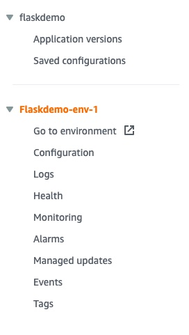
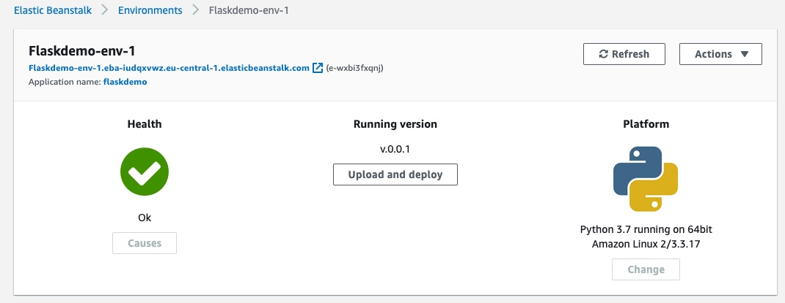
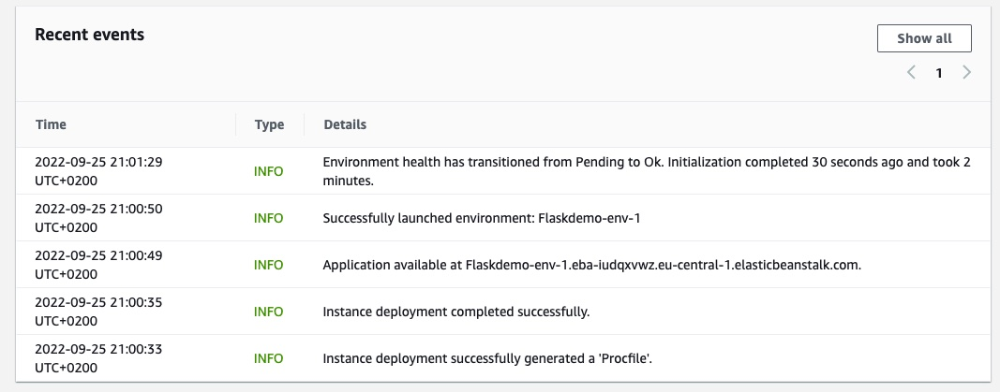
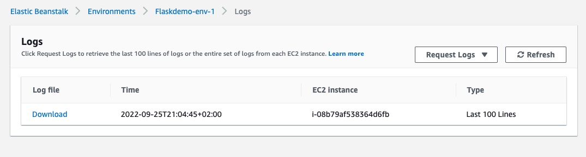

# Flask Deployment in Elastic Beanstalk

### Step 1
- Flask App file creation as `application.py`
- Beanstalk will look for file naming `application.py`. Then it starts this file as app.
```
from flask import Flask

# application need to mentioned for beanstalk to understand this is app
# app for internal flask understanding
application = app = Flask(__name__)

@app.route('/')
def hello():
    return 'Hello, World!'

if __name__ == "__main__":
    app.run()
```

### Step 2
- Create requirements.txt file. So that elastic beanstalk create internal venv using this requirements file. And starts Flask app
```yaml
Flask==2.2.2
Jinja2==3.1.2
```

### Step 3
- Need to create zip file out of (application.py & requirements.txt)
- [Note] : Zip should be done without root folder structure
- `In general zip creation behaviour`
```text
Ex:-
flaskdemo.zip
- folder
    - application.py
    - requirements.txt
```
- `Expected`
```text
flaskdemo.zip
    - application.py
    - requirements.txt
```
- Command to create zip file without root folder. Go to folder having 2 files. i.e., application.py & requirements.txt
- [Note] Try to execute in linux(ubuntu). In mac it does't work
```bash
zip -r -j flaskdemo.zip *
```

### Step 4 
- Go to Elastic Beanstalk. Create Application and Environment. Then upload our .zip file and at end deploy, to start the flask application.
- Process
    - Go to : AWS `Elastic Beanstalk` service
    - Click `Creation Application`
    - Application name `flasdemo`
    - platform `python`
    - platform branch `Python 3.7 running on 64bit Amazon Linux 2`
    - Platform version `3.3.17 (Recommended)`
    - Application code
        - Upload code
        - Version label -> v.0.0.1
        - Local file -> choose file -> file browser(select flaskdemo.zip)
    - Create Application

### Flask App & Env Creation
-  

### Deployment Status
-  
-  

### Logs Investigation 
- In case health status goes severe / failed / etc.,
- 


### Reference
- https://docs.aws.amazon.com/elasticbeanstalk
- https://stackoverflow.com/questions/62479386/no-module-named-application-error-while-deploying-simple-web-app-to-elastic-be
- https://docs.aws.amazon.com/elasticbeanstalk/latest/dg/create-deploy-python-flask.html
- https://stackoverflow.com/questions/70481644/modulenotfounderror-no-module-named-application-when-deploying-flask-app-on-a